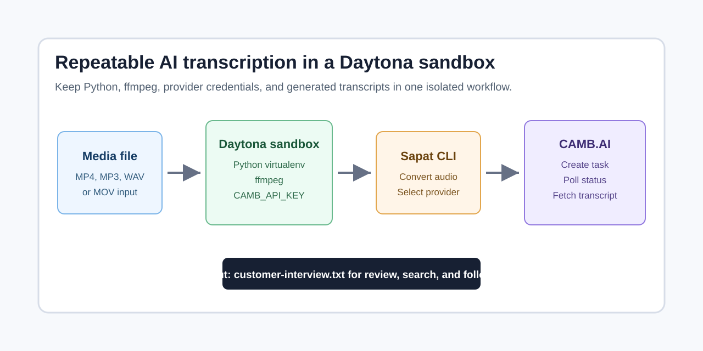

# Run CAMB.AI Transcription in Daytona

Audio and video recordings are useful only after the team can search, quote, and
share what was said. A raw meeting recording still needs a reproducible
environment, a transcription provider, and a workflow that keeps API keys and
customer data out of source control.

This guide shows how to run an AI transcription tool in a Daytona sandbox using
[Sapat](https://github.com/nibzard/sapat) and CAMB.AI. You will create an
isolated sandbox, install Sapat, enable the CAMB.AI provider, process a media
file, and save the transcript next to the original recording. The same setup can
be used for product interviews, sales calls, design reviews, podcast drafts, and
any other workflow where a developer wants clean text from recorded speech.



## TL;DR

- **Create the sandbox**: Use Daytona to get a clean environment instead of
  debugging Python, ffmpeg, and API credentials on your laptop.
- **Install Sapat**: Sapat converts video to the provider's preferred audio
  format and writes a transcript to a `.txt` file.
- **Use CAMB.AI**: CAMB.AI runs an
  [asynchronous transcription pipeline](/definitions/20260617_definition_asynchronous_transcription_pipeline.md)
  with task creation, status polling, and result retrieval.
- **Keep secrets local**: Export `CAMB_API_KEY` inside the sandbox or use a
  local `.env` file that never gets committed.

## Why Run Transcription Inside Daytona?

Transcription work often starts as a small script and grows into a repeatable
team workflow. One person installs Python 3.12, another has a different ffmpeg
build, and a third person has no provider credentials in the right shell. The
result is slow setup, not better transcripts.

Daytona gives this workflow a stable sandbox. The repository, Python packages,
and media processing tools live in the same environment every time. That matters
for transcription because most tools have at least three moving parts:

| Layer | What can break | Daytona benefit |
| --- | --- | --- |
| Runtime | Wrong Python or missing package | Install and test once in the sandbox |
| Media conversion | Missing `ffmpeg` or incompatible local codec | Keep conversion tools in one environment |
| Provider access | API key set in one shell but not another | Scope secrets to the sandbox session |

Sapat fits this model because it is a command-line tool. You pass in a video or
audio file, choose a provider, and receive a text file. The CAMB.AI provider
adds a hosted transcription backend that can return speaker-labeled, timestamped
segments through the official API.

## Prerequisites

You need the following before starting:

- A Daytona account and the Daytona CLI. The current CLI documentation is at
  [Daytona CLI](https://www.daytona.io/docs/en/tools/cli/).
- A CAMB.AI API key from CAMB.AI Studio.
- A short `.mp4`, `.mp3`, `.wav`, `.aac`, `.flac`, or `.mov` file to test.
- Basic terminal access to the Daytona sandbox.

For a first pass, use a short internal recording. This keeps upload time low,
reduces provider spend, and makes it easier to confirm that the output file
looks right before you process longer material.

## Step 1: Create a Daytona Sandbox

Install the Daytona CLI if you have not already done so. On macOS with
Homebrew, the current documentation uses:

```bash
brew install daytonaio/cli/daytona
```

Log in with your Daytona API key:

```bash
daytona login --api-key=YOUR_DAYTONA_API_KEY
```

Create a sandbox for the transcription workflow:

```bash
daytona create --name sapat-cambai-transcription
```

Connect to it:

```bash
daytona ssh sapat-cambai-transcription
```

The remaining commands run inside the sandbox. Keeping the setup there is the
point: the Python environment, package cache, media conversion tools, and
transcription runs are now isolated from your local machine.

## Step 2: Install System and Python Dependencies

Sapat converts media files before handing them to a provider, so confirm that
`ffmpeg` is available:

```bash
ffmpeg -version
```

If the command is missing in your sandbox image, install it:

```bash
sudo apt-get update
sudo apt-get install -y ffmpeg
```

Clone Sapat and enter the repository:

```bash
git clone https://github.com/nibzard/sapat.git
cd sapat
```

The CAMB.AI provider is implemented in the companion Sapat pull request for
this guide. If the provider has not been merged into Sapat yet, pull that branch
before installing:

```bash
git fetch https://github.com/jackjin1997/sapat add-cambai-provider
git switch --detach FETCH_HEAD
```

Create a virtual environment and install Sapat:

```bash
python -m venv .venv
. .venv/bin/activate
pip install -e ".[dev]"
```

Run the focused provider test to confirm that the CAMB.AI integration is
available:

```bash
python -m pytest tests/providers/test_group_b.py -k CambAI -q
```

You should see the CAMB.AI tests pass without using a real API call. The tests
mock the upload, polling, and result-fetch requests so that you can validate the
provider wiring before spending provider credits.

## Step 3: Configure CAMB.AI Access

Export your CAMB.AI key in the sandbox shell:

```bash
export CAMB_API_KEY="YOUR_CAMB_API_KEY"
```

For longer recordings, you can slow the polling cadence and raise the timeout:

```bash
export CAMB_POLL_INTERVAL_SECONDS=15
export CAMB_TIMEOUT_SECONDS=1800
```

Do not commit these values. If you prefer a `.env` file, keep it local to the
sandbox and confirm that it is ignored by Git before pushing any branch.

CAMB.AI's transcription API follows a task pattern:

1. Submit the media file to `POST /transcribe`.
2. Poll `GET /transcribe/{task_id}` until the task reaches a terminal status.
3. Fetch the transcript from `GET /transcription-result/{run_id}`.

Sapat wraps that flow behind one CLI command, but it is useful to understand the
three steps when you are debugging provider responses or rate limits.

## Step 4: Add a Media File

Create a folder for local test media:

```bash
mkdir -p media
```

Place a short audio or video file in that folder. For example:

```text
media/customer-interview.mp4
```

Use a real clip from your workflow, but avoid sensitive production recordings
until you have confirmed retention, privacy, and access policies for your team.
For the first run, a one-minute synthetic or internal recording is enough.

## Step 5: Run Sapat With the CAMB.AI Provider

Run Sapat with the `cambai` provider:

```bash
sapat media/customer-interview.mp4 --provider cambai --language en-us --quality M
```

Sapat will:

1. Convert the input file to CAMB.AI's preferred MP3 format.
2. Submit the converted media to CAMB.AI.
3. Poll until the transcription task completes.
4. Fetch the final transcript.
5. Write a text file next to the source recording.
6. Remove the temporary audio conversion file.

After the command finishes, inspect the generated transcript:

```bash
sed -n '1,80p' media/customer-interview.txt
```

The CLI output is intentionally simple. It gives you a plain text transcript
that can move into a research note, issue comment, support reply, changelog
draft, or review document.

## Step 6: Turn the Transcript Into a Review Packet

A transcript is more valuable when it is attached to the rest of the work. For
product teams, the following lightweight packet works well:

| File | Purpose |
| --- | --- |
| `customer-interview.mp4` | Original recording for audit or replay |
| `customer-interview.txt` | Full transcript generated by Sapat |
| `customer-interview-summary.md` | Human-edited notes, quotes, and follow-ups |
| `customer-interview-actions.md` | Issues, owners, and next steps |

Keep the generated transcript separate from the edited summary. That makes it
clear which file is raw provider output and which file contains human judgment.
When the transcript includes customer names, contract details, or roadmap
questions, store it under the same access policy as the source recording.

## Common Issues and Troubleshooting

**Problem:** `Provider 'cambai' is not available.`

**Solution:** Confirm that `CAMB_API_KEY` is set in the same shell where you run
`sapat`. Sapat only lists providers whose required environment variables are
present.

**Problem:** The upload fails because the file is too large.

**Solution:** CAMB.AI documents a 20 MB file limit for this endpoint. The Sapat
provider declares that limit so large converted files can be split into chunks
before transcription. You can also start with a shorter clip to validate the
workflow quickly.

**Problem:** The transcript is poor for non-English audio.

**Solution:** Pass the closest locale code with `--language`, such as
`es-es`, `fr-fr`, `de-de`, `ja-jp`, or `zh-cn`. CAMB.AI's language support page
uses locale tags such as `en-us` for the API language parameter.

**Problem:** Polling ends with `PAYMENT_REQUIRED`.

**Solution:** Check your CAMB.AI account balance, plan access, and API key. Sapat
surfaces this as a failed task because the provider cannot fetch a run result
until the upstream task succeeds.

**Problem:** `ffmpeg` cannot decode the input file.

**Solution:** Re-encode the source into a common format such as MP4 or WAV, then
rerun Sapat. A quick sanity check is `ffmpeg -i media/customer-interview.mp4`
inside the sandbox.

## Conclusion

You now have a repeatable AI transcription workflow in Daytona. The sandbox
keeps setup consistent, Sapat handles media conversion and provider selection,
and CAMB.AI handles the hosted speech-to-text job behind a single CLI command.

This pattern is easy to extend. Add a repository-specific `media/README.md`,
store sanitized transcripts with design notes, or wire the same command into a
review checklist for interviews and demos. The important part is that the
transcription environment is no longer a one-off laptop setup.

## References

- [Daytona CLI documentation](https://www.daytona.io/docs/en/tools/cli/)
- [CAMB.AI create transcription API](https://docs.camb.ai/api-reference/endpoint/create-transcription)
- [CAMB.AI transcription task status API](https://docs.camb.ai/api-reference/endpoint/poll-transcription-result)
- [CAMB.AI transcription result API](https://docs.camb.ai/api-reference/endpoint/get-transcription-run-result)
- [CAMB.AI language support](https://docs.camb.ai/language-support)
- [Sapat repository](https://github.com/nibzard/sapat)
- [Companion Sapat CAMB.AI provider pull request](https://github.com/nibzard/sapat/pull/66)
